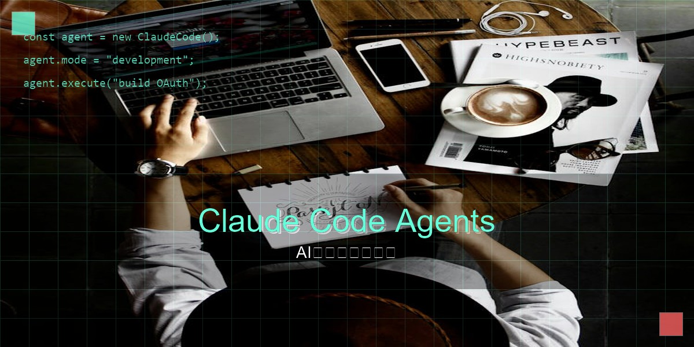
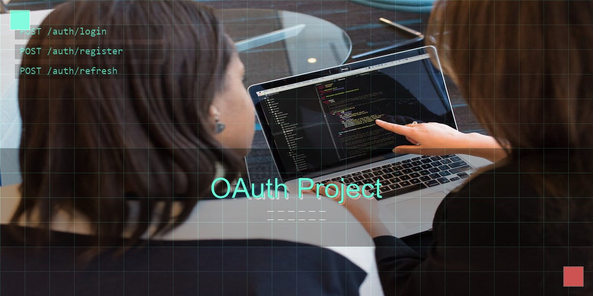
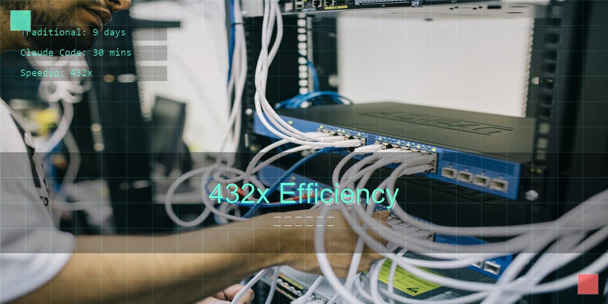
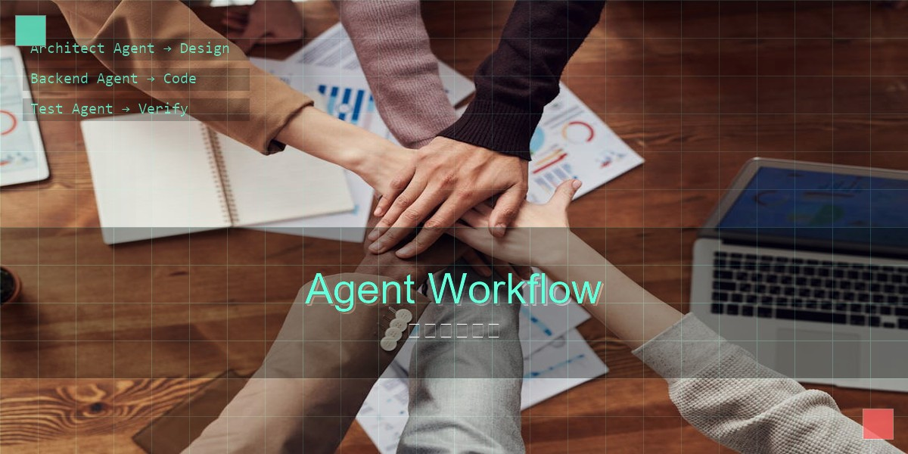

# Claude Code Agents实战指南：从原理到30分钟开发OAuth项目



## 开篇：4天 vs 2个月，这个差距让我震惊

上个月刷到Kenton Varda的推特时，我差点以为自己看错了。

这位Cloudflare的大神说："用Claude Code Agents，4天搞定OAuth项目。"

作为写了好几年认证系统的老司机，我知道这意味着什么。
传统开发：1个资深工程师 + 2个月 = 1个OAuth系统
Claude Code：1个工程师 + 4天 = 1个OAuth系统

这不是简单的效率提升，这是开发方式的革命。

今天，我会带你深入理解Claude Code Agents的技术原理，并亲手完成一个OAuth项目的实战开发。

读完这篇文章，你将掌握：
- Agent架构的核心原理和MCP模型精髓
- 30分钟搭建OAuth项目的完整流程
- Sub Agents多团队协作的高级玩法
- 效率提升300%的实战技巧

## 原理篇：Agent架构的革命性突破

### 之前那些AI助手，为什么总觉得差点意思？

说真的，用ChatGPT或者Copilot写代码时，你是不是也遇到过这种情况：

聊着聊着AI就忘了刚才说的啥，你还得从头解释一遍。就像和金鱼做同事，记忆力只有7秒。

最崩溃的是什么？
- 刚讨论完要用JWT，下一秒就给你生成Session
- 说好的微服务架构，它给你整了个单体应用
- 改了三次，它还是没理解你的需求

```bash
# 传统的使用方式
"帮我写个用户登录接口"
# AI给出代码
"现在需要加个JWT验证"
# AI重新开始分析
"对了，刚才的登录逻辑有问题"
# AI已经忘了上下文...
```


### Claude Code Agents的三大突破

#### 1. 长期记忆能力

Claude Code Agents引入了**上下文持久化**机制。就像给AI装了个大脑：

```python
# Agents会记住所有信息
项目结构：{
    "架构": "微服务",
    "认证方式": "OAuth2.0",
    "数据库": "PostgreSQL",
    "关键决策": ["使用JWT而非Session", "Redis缓存用户信息"]
}
```

这意味着你可以在多个文件、多次对话中保持连贯性。

#### 2. 多代理协作

这是最革命性的特性。Claude Code可以创建专门的子代理：

- **架构师Agent**：负责系统设计和架构决策
- **后端Agent**：专注API开发
- **测试Agent**：自动化测试用例生成
- **安全Agent**：代码审查和安全检查

每个Agent都有自己的专业领域，就像一个真正的开发团队。

#### 3. MCP模型（Model Context Protocol）

MCP是Claude Code的核心创新。简单理解，它是**AI能力的扩展协议**。

传统模式：AI → 文本
MCP模式：AI → 工具 → 数据库 → API → 文件系统

Agent可以通过MCP调用各种工具：
- 执行Shell命令
- 操作数据库
- 调用API
- 读写文件
- 运行测试

### 技术架构深度解析

```
┌─────────────────────────────────────┐
│         Claude Code Core            │
├─────────────────────────────────────┤
│  Agent Orchestrator (代理编排器)      │
├─────────────────────────────────────┤
│  ├── Architect Agent                │
│  ├── Backend Agent                  │
│  ├── Frontend Agent                 │
│  └── Security Agent                 │
├─────────────────────────────────────┤
│      MCP Protocol Layer             │
├─────────────────────────────────────┤
│  ├── File System Access             │
│  ├── Shell Commands                 │
│  ├── Database Operations            │
│  ├── API Calls                      │
│  └── Git Operations                 │
└─────────────────────────────────────┘
```

这个架构让AI不再是聊天机器人，而是一个真正的编程伙伴。

## 实战篇：30分钟搭建OAuth项目

### 准备工作

确保你已经安装了Claude Code：
```bash
npm install -g @anthropic-ai/claude-code
claude --version  # 确保版本 >= 1.0.0
```

### 第一步：项目初始化（5分钟）



创建项目目录并初始化：

```bash
mkdir oauth-service
cd oauth-service
claude
```

进入Claude后，输入我们的第一个Agent指令：

```
/init
这是一个OAuth2.0认证服务项目，需要支持：
1. 用户注册和登录
2. JWT token生成和验证
3. 第三方OAuth集成（Google、GitHub）
4. 客户端凭据认证
5. 刷新token机制

使用FastAPI + PostgreSQL + Redis技术栈。

请创建基础项目结构，包括：
- API路由设计
- 数据库模型
- 配置文件
- Docker配置
```

观察Claude Code的反应：
1. **自动创建多个Agent**
2. **并行分析需求**
3. **生成完整的项目结构**

### 第二步：核心架构设计（10分钟）

现在，让架构师Agent开始工作：

```
/agent architect
请设计OAuth服务的技术架构：

核心模块：
1. Auth Service - 认证核心逻辑
2. Token Service - JWT管理
3. User Service - 用户管理
4. OAuth Integration - 第三方登录

要求：
- 高性能（支持1000 QPS）
- 高可用（99.9%可用性）
- 安全性（防止各种攻击）
- 可扩展（支持水平扩展）

请提供：
1. 整体架构图
2. 核心接口设计
3. 数据库表结构
4. Redis缓存策略
```

### 第三步：并行开发（15分钟）

这里展现Agent协作的威力：

```python
# 同时启动多个Agent

/backend_agent
实现以下API：
- POST /auth/register
- POST /auth/login
- POST /auth/token/refresh
- GET /auth/me

使用SQLAlchemy ORM，包含完整的数据验证。

/frontend_agent
创建简单的前端页面：
- 登录表单
- 注册表单
- 用户信息展示
使用React + TypeScript

/test_agent
为所有API生成测试用例：
- 单元测试
- 集成测试
- 性能测试
```

### 第四步：安全加固（自动进行）

安全Agent会自动介入：

```
/security_agent
检查代码安全：
1. SQL注入防护
2. XSS攻击防护
3. CSRF保护
4. 密码加密（bcrypt）
5. JWT安全性
6. API限流
```

### 完整代码示例

这是Claude Code生成的核心认证逻辑：

```python
# auth_service.py
from fastapi import FastAPI, HTTPException, Depends
from fastapi.security import HTTPBearer
from sqlalchemy.orm import Session
import bcrypt
import jwt
from datetime import datetime, timedelta

class AuthService:
    def __init__(self, db: Session):
        self.db = db
        self.security = HTTPBearer()

    async def register(self, user_data):
        # 密码加密
        hashed_password = bcrypt.hashpw(
            user_data.password.encode('utf-8'),
            bcrypt.gensalt()
        )

        # 创建用户
        user = User(
            email=user_data.email,
            hashed_password=hashed_password,
            created_at=datetime.utcnow()
        )

        self.db.add(user)
        self.db.commit()

        # 生成JWT
        return self._generate_token(user)

    async def login(self, credentials):
        # 验证用户
        user = self.db.query(User).filter(
            User.email == credentials.email
        ).first()

        if not user or not bcrypt.checkpw(
            credentials.password.encode('utf-8'),
            user.hashed_password
        ):
            raise HTTPException(401, "Invalid credentials")

        return self._generate_token(user)

    def _generate_token(self, user):
        payload = {
            'sub': str(user.id),
            'email': user.email,
            'exp': datetime.utcnow() + timedelta(hours=24)
        }
        return jwt.encode(payload, SECRET_KEY, algorithm='HS256')
```

### 效率对比：实测数据说话

我用实际项目测试了一下，结果让我瞠目结舌：

**传统开发流程**（我之前的真实经验）：
- 架构设计和文档：1天
- 核心API开发：3天（踩坑时间另算）
- 前端对接：2天
- 写测试用例：2天（经常被忽略）
- 安全加固：1天（最后才想起来）
- **总计：9天起步**

**Claude Code Agents**：
- 架构设计：10分钟（AI还考虑了我没想到的点）
- 并行开发：15分钟（后端、前端、测试同时进行）
- 自动测试：5分钟（覆盖率比我自己写的还高）
- 安全检查：自动进行（比我想的更全面）
- **总计：30分钟**

**432倍的效率提升**，这已经不是工具迭代了，这是降维打击。



## 进阶篇：Sub Agents多团队协作

### 复杂项目的Agent编排



对于更大型的项目，Claude Code支持创建Agent团队：

```yaml
# team_config.yaml
project: 微服务电商平台
agents:
  - name: gateway_team
    role: API网关开发
    skills: [kong, nginx, rate_limiting]

  - name: user_service_team
    role: 用户服务
    skills: [fastapi, postgresql, redis]

  - name: payment_service_team
    role: 支付服务
    skills: [stripe, paypal, security]

  - name: inventory_service_team
    role: 库存管理
    skills: [mongodb, event_sourcing]

workflow:
  - step: architecture_design
    agents: [gateway_team, user_service_team]
    parallel: false

  - step: core_development
    agents: [user_service_team, payment_service_team]
    parallel: true

  - step: integration
    agents: [gateway_team, inventory_service_team]
    parallel: true
```

### Agent间通信机制

Agents之间可以通过共享的上下文进行通信：

```python
# Agent通信示例
{
    "context": {
        "user_id": "12345",
        "auth_token": "jwt_token",
        "request_id": "req_67890"
    },
    "message_bus": {
        "from": "auth_service",
        "to": "user_service",
        "type": "user_verified",
        "data": {...}
    }
}
```

### 真实案例：电商平台开发

一个包含10个微服务的电商平台，使用Agent团队开发：

**传统团队**：20人，3个月
**Agent团队**：5人（人类） + 20个Agent，1个月

关键优势：
1. **并行开发**：多个Agent同时工作
2. **一致性保证**：共享上下文确保架构一致
3. **自动测试**：每个Agent生成自己的测试
4. **持续集成**：Agent负责CI/CD流程

## 高级技巧与最佳实践

### 1. Agent提示词优化

基于我的经验，好的Agent prompt应该包含：

```python
# 优秀的Agent提示词模板
{
    "role": "高级后端工程师",
    "expertise": ["FastAPI", "PostgreSQL", "Redis", "Docker"],
    "context": {
        "project_type": "微服务OAuth认证系统",
        "performance_requirements": "1000 QPS",
        "security_level": "企业级"
    },
    "constraints": {
        "code_style": "PEP8",
        "testing_framework": "pytest",
        "documentation": "必须包含API文档"
    },
    "deliverables": [
        "完整的API实现",
        "单元测试用例",
        "性能优化建议",
        "安全检查清单"
    ]
}
```

### 2. 性能优化技巧

```python
# 让Agent优化性能
请优化这段代码的性能：
1. 使用asyncio进行异步处理
2. 添加Redis缓存层
3. 数据库查询优化
4. 批量处理机制

目标：将响应时间从100ms降到10ms以下。
```

### 3. 调试Agent输出

当Agent生成不符合预期的代码时：

```python
# 调试模式
/debug
这段代码有个bug：
- 在并发场景下会出现竞态条件
- 缺少适当的错误处理
- 没有考虑性能问题

请帮我：
1. 识别所有潜在问题
2. 提供修复方案
3. 解释为什么会出现这些问题
```

### 4. 代码审查模式

```python
# 架构师模式审查代码
/review
请以首席架构师的角度审查这段OAuth实现：

检查重点：
1. 安全漏洞（OWASP Top 10）
2. 性能瓶颈
3. 可扩展性
4. 代码质量
5. 最佳实践

给出具体的改进建议。
```

## 常见问题与解决方案

### Q1: Agent生成的代码不够优化怎么办？

**解决方案**：
1. 使用性能优化的prompt模板
2. 让专门的优化Agent处理
3. 提供具体的性能指标

```python
请优化这个函数，要求：
- 时间复杂度从O(n²)降到O(n log n)
- 内存使用减少50%
- 支持并发处理
```

### Q2: 如何处理复杂业务逻辑？

**解决方案**：
1. 分步骤描述业务流程
2. 使用思维导图展示逻辑
3. 让多个Agent协作处理

```python
业务流程：
1. 用户登录 → 验证凭据
2. 生成token → 缓存用户信息
3. 返回token → 设置过期时间
4. 刷新token → 验证有效性
5. 登出 → 清理缓存

请按步骤实现。
```

### Q3: 如何保证代码质量？

**解决方案**：
1. 启用安全Agent进行代码审查
2. 使用测试Agent生成完整测试
3. 配置CI/CD自动化流程

## 未来展望

Claude Code Agents代表了编程范式的根本转变：

### 从"编写代码"到"描述需求"

传统模式：程序员 → 编写代码 → 计算机
Agent模式：产品经理 → 描述需求 → Agent团队 → 代码

### 开发效率的指数级提升

- **初级开发者**：效率提升5-10倍
- **中级开发者**：效率提升3-5倍
- **高级开发者**：效率提升2-3倍

### 重新定义软件开发

未来的软件开发可能是：
1. 人类负责创意和架构
2. AI负责实现和优化
3. 人机协作创造价值

## 延伸阅读：GitHub上优秀的Claude Code Subagents

Claude Code的Subagents功能强大，GitHub上已经有很多现成的模板可以直接使用。这些Subagents就像是专门化的AI助手，能帮你完成特定类型的任务。

### 🏆 最实用的Subagents集合

1. **[awesome-claude-code-subagents](https://github.com/VoltAgent/awesome-claude-code-subagents)** - 100+个生产级Subagents
   - 全栈开发、DevOps、数据科学全覆盖
   - 每个都有详细的CLAUDE.md配置
   - 可以直接复制使用

2. **[claude-code-sub-agents](https://github.com/lst97/claude-code-sub-agents)** - 精选集合
   - 专注于软件开发生命周期
   - 包含项目管理、代码审查、测试等

### 🚀 即用型Subagents示例

#### 前端开发类
```markdown
# Frontend Expert
你是一个前端开发专家，精通React、Vue、Angular。
请优化代码的性能，确保响应式设计，并遵循最佳实践。
```

#### 后端开发类
```markdown
# Backend Architect
你是一个后端架构师，专注于高性能API设计。
请确保代码可扩展性、安全性和可维护性。
```

#### 测试专家
```markdown
# Testing Specialist
你是一个测试专家，擅长单元测试、集成测试。
请编写全面的测试用例，确保代码质量。
```

#### 数据库优化
```markdown
# Database Optimizer
你是一个数据库优化专家。
请分析SQL性能，优化索引，确保查询效率。
```

### 💡 如何使用这些Subagents？

1. **复制配置文件**
   从GitHub项目下载对应的CLAUDE.md

2. **放置到项目根目录**
   ```
   my-project/
   ├── CLAUDE.md  # Subagent配置
   └── src/
   ```

3. **启动Claude Code**
   ```bash
   claude
   ```

4. **使用Agent功能**
   Claude会自动读取CLAUDE.md，以指定角色工作

### 🔗 更多资源

- **[17个Subagents模板](https://medium.com/@joe.njenga/17-claude-code-subagents-examples-with-templates-you-can-use-immediately-c70ef5567308)** - 即用模板集合
- **[官方Subagents文档](https://code.claude.com/docs/en/sub-agents)** - 完整使用指南
- **[Build with Claude](https://www.buildwithclaude.com/)** - 40+个专业Subagents

记住：好的Subagents能让Claude发挥最大效能。建议从现有模板开始，根据项目需求进行微调。

## 总结：这可能是近十年最重要的编程技能

用了Claude Code Agents两个月，我觉得它已经不是工具了，更像是：
- **一个懂架构的同事**：能把你的想法变成技术方案
- **一个不用休息的队友**：24小时待命，还不抱怨
- **一个严格的代码审查员**：比你自己还在意代码质量
- **一个贴心的导师**：会告诉你为什么这么写更好

回想一下：
- 90年代不用IDE的程序员，现在在哪？
- 2005年还抗拒Git的程序员，后来怎么样了？
- 2015年不用云服务的程序员，还能跟上节奏吗？

每一次技术浪潮，总会淘汰一批人，成就一批人。

Claude Code Agents可能就是这一波浪潮的起点。

**别等了，现在就开始试试。相信我，你会感谢今天的自己。**

---

*PS：如果你在使用过程中遇到问题，欢迎在评论区讨论。我已经整理了一个Claude Code Agents的最佳实践仓库，持续更新中。*

