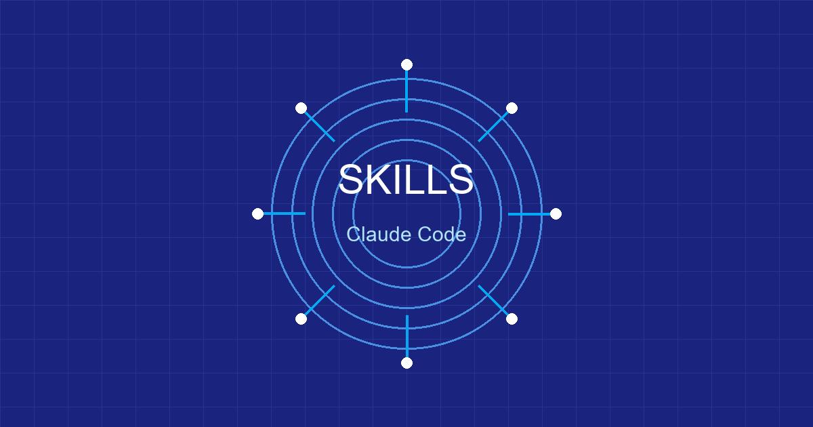
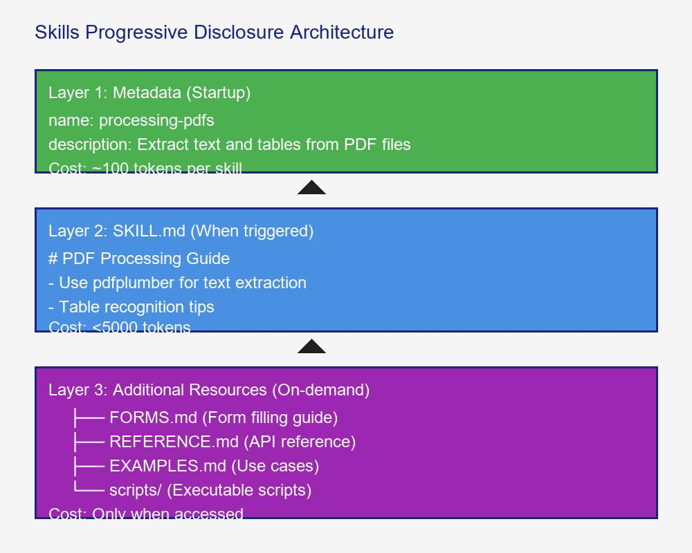

# Claude Code Skills完全指南：从原理到实战打造可复用AI能力



## 开篇：为什么说Skills可能比MCP更值得关注？

2025年10月16日，Anthropic悄悄发布了一个新功能：**Agent Skills**。

说实话，刚看到这个功能时，我还没太当回事。又是一个"AI能力扩展"的东西，能有多大的创新？

但当我真正深入使用之后，我发现我错了。

**Skills解决了一个AI编程领域的核心难题：如何让AI"记住"和"复用"专业知识？**

你可以把Skills理解为：**给AI装上的"技能包"**。就像游戏里的角色可以学习各种技能一样，Claude也可以通过Skills获得专业能力。

- 想让Claude擅长处理PDF？装个PDF Skill
- 想让Claude会写测试？装个测试Skill
- 想让Claude懂你的业务逻辑？写个自定义Skill

这篇文章，我会带你：
1. 理解Skills的技术原理（它为什么这么聪明）
2. 掌握渐进式披露架构（token效率的秘密）
3. 动手打造一个实战Skill（30分钟搞定）
4. 了解Skills生态系统（GitHub上的宝藏）

读完之后，你会发现：**Skills可能确实是比MCP更重要的创新**。

---

## 原理篇：Skills的技术架构深度解析

### 从问题开始：为什么需要Skills？

想象一个场景：

你是个量化交易开发者，经常需要让AI帮你处理金融数据。每次都要跟Claude解释：

```bash
# 第一次对话
"帮我分析这个CSV文件，注意：
- 日期格式是YYYY-MM-DD
- 价格字段需要处理千分位
- 股票代码是6位数字
- ..."

# 第二天，另一个文件
"再帮我分析一下这个文件，同样的要求..."

# 一周后
"又来一个文件，还是那些规则..."
```

**问题很明确**：
1. 重复劳动：每次都要重新解释
2. 浪费token：同样的规则说了一遍又一遍
3. 不够专业：Claude记不住你的业务逻辑

**Skills的解决方案**：

把专业知识打包成一个"技能包"，Claude需要时自动加载。

```
传统方式：
每次对话 → 重新解释 → 浪费token

Skills方式：
打包知识 → Claude自动识别 → 按需加载 → 极致效率
```

### Skills的核心：渐进式披露架构

这是Skills最重要的技术创新。

**问题背景**：AI的上下文窗口是有限的资源。如果你把所有知识都塞进去，要么用不完，要么太贵。

**渐进式披露**的设计哲学：

> 只在需要的时候，加载需要的知识。就像一个聪明的图书管理员，不会把整个图书馆搬到你的桌上。

**三层加载机制**：



**实际效果**：

假设你装了20个Skills：
- **传统方式**：所有内容加载，可能消耗10万+ tokens
- **渐进式披露**：只加载元数据，约2000 tokens
- **触发某个Skill时**：才加载完整内容（约5000 tokens）
- **节省比例**：高达95%

### Skill的文件结构

一个完整的Skill是一个文件夹：


**SKILL.md的结构**（最重要）：

```markdown
---
name: processing-pdfs
description: 从PDF中提取文本和表格，支持表单填写。使用PDF相关功能时自动触发。
---

# PDF处理指南

## 快速开始

使用pdfplumber提取文本：

\`\`\`python
import pdfplumber

with pdfplumber.open("file.pdf") as pdf:
    text = pdf.pages[0].extract_text()
\`\`\`

## 高级功能

**表单处理**：见 [FORMS.md](FORMS.md)
**API参考**：见 [REFERENCE.md](REFERENCE.md)
**实战案例**：见 [EXAMPLES.md](EXAMPLES.md)
```

### Skills vs 其他方案的对比


**选择建议**：
- **复用专业知识** → Skills
- **项目特定规则** → CLAUDE.md
- **频繁使用的快捷操作** → Slash Commands
- **连接外部API/数据库** → MCP

---

## 实战篇：30分钟打造你的第一个Skill

### 场景设定：量化交易数据清洗Skill

作为量化交易者，我经常需要让AI处理各种金融数据。每次都要解释：
- 日期格式转换
- 价格字段清洗（千分位、单位转换）
- 缺失值处理
- 异常值检测

今天，我们把这些知识打包成一个Skill。

### 准备工作（2分钟）

确保你有Claude Code CLI：

```bash
# 检查安装
claude --version

# 没安装的话
npm install -g @anthropic-ai/claude-code
```

### 第一步：创建Skill结构（3分钟）

```bash
# 创建Skill目录
mkdir -p ~/.claude/skills/quant-data-processor
cd ~/.claude/skills/quant-data-processor

# 创建必要文件
touch SKILL.md
touch REFERENCE.md
touch EXAMPLES.md
mkdir -p scripts
```

### 第二步：编写SKILL.md（10分钟）

**核心要点**：
1. frontmatter要清晰（name和description最重要）
2. 保持简洁（Claude已经很聪明，不需要教它基础概念）
3. 提供清晰的导航（链接到其他文件）

```markdown
---
name: quant-data-processor
description: 处理量化交易数据，包括日期转换、价格清洗、缺失值处理和异常值检测。当处理金融数据、股票数据、CSV文件时自动触发。
---

# 量化交易数据清洗指南

## 核心原则

1. **数据完整性优先**：宁可丢弃异常数据，也不要引入错误
2. **可追溯性**：所有转换操作都要有日志
3. **性能考虑**：大数据集使用向量化操作

## 标准处理流程

### 1. 日期处理

中国A股日期格式通常是 `YYYY-MM-DD` 或 `YYYYMMDD`：

\`\`\`python
import pandas as pd

# 标准化日期格式
df['date'] = pd.to_datetime(df['date'], format='%Y-%m-%d')
df['date'] = df['date'].dt.strftime('%Y-%m-%d')
\`\`\`

### 2. 价格清洗

价格字段可能包含千分位、单位（万、亿）等：

\`\`\`python
def clean_price(price_str):
    if isinstance(price_str, (int, float)):
        return float(price_str)

    # 移除千分位逗号
    price_str = price_str.replace(',', '')

    # 处理中文单位
    if '万' in price_str:
        return float(price_str.replace('万', '')) * 10000
    elif '亿' in price_str:
        return float(price_str.replace('亿', '')) * 100000000

    return float(price_str)

df['close'] = df['close'].apply(clean_price)
\`\`\`

### 3. 缺失值处理

\`\`\`python
# 检查缺失值
missing = df.isnull().sum()

# 价格数据：前向填充
df['close'].fillna(method='ffill', inplace=True)

# 成交量缺失：填充为0
df['volume'].fillna(0, inplace=True)
\`\`\`

### 4. 异常值检测

使用3-sigma规则检测价格异常：

\`\`\`python
def detect_outliers(df, column='close', threshold=3):
    mean = df[column].mean()
    std = df[column].std()
    upper = mean + threshold * std
    lower = mean - threshold * std

    outliers = df[(df[column] > upper) | (df[column] < lower)]
    return outliers

outliers = detect_outliers(df)
\`\`\`

## 实用脚本

运行辅助脚本：
- **数据验证**：`python scripts/validate_data.py <file.csv>`
- **生成报告**：`python scripts/generate_report.py <file.csv>`

## 高级用法

- **复杂数据转换**：见 [REFERENCE.md](REFERENCE.md)
- **实战案例**：见 [EXAMPLES.md](EXAMPLES.md)
```

### 第三步：编写参考文档（10分钟）

REFERENCE.md 提供详细的API和模式参考：

```markdown
# 数据清洗参考

## 常见数据源格式

### TuShare格式

\`\`\`
ts_code,trade_date,open,high,low,close,vol,amount
000001.SZ,20250102,10.50,10.80,10.45,10.75,1234567,13245678.90
\`\`\`

### 东方财富格式

\`\`\`
代码,日期,开盘价,最高价,最低价,收盘价,成交量,成交额
000001,2025-01-02,10.50,10.80,10.45,10.75,1,234,567,1,324.57万
\`\`\`

## 字段映射表

| 字段 | TuShare | 东方财富 | 标准字段 |
|------|---------|----------|----------|
| 股票代码 | ts_code | 代码 | symbol |
| 日期 | trade_date | 日期 | date |
| 开盘价 | open | 开盘价 | open |
| 收盘价 | close | 收盘价 | close |
| 成交量 | vol | 成交量 | volume |

## 性能优化

### 大文件处理

\`\`\`python
# 分块读取
chunk_size = 10000
chunks = pd.read_csv('large_file.csv', chunksize=chunk_size)

for chunk in chunks:
    process_chunk(chunk)
\`\`\`

### 向量化操作

\`\`\`python
# 慢：循环处理
for i in range(len(df)):
    df.loc[i, 'returns'] = df.loc[i, 'close'] / df.loc[i-1, 'close'] - 1

# 快：向量化
df['returns'] = df['close'].pct_change()
\`\`\`
```

### 第四步：编写辅助脚本（5分钟）

创建一个数据验证脚本：

```python
# scripts/validate_data.py
import pandas as pd
import sys

def validate_data(file_path):
    """验证数据质量"""
    df = pd.read_csv(file_path)

    issues = []

    # 检查必需列
    required_cols = ['date', 'close']
    missing_cols = set(required_cols) - set(df.columns)
    if missing_cols:
        issues.append(f"缺少必需列: {missing_cols}")

    # 检查缺失值
    missing = df.isnull().sum()
    if missing.any():
        issues.append(f"缺失值统计:\n{missing[missing > 0]}")

    # 检查日期格式
    try:
        pd.to_datetime(df['date'])
    except:
        issues.append("日期格式错误")

    # 检查价格范围
    if (df['close'] <= 0).any():
        issues.append("存在非正价格")

    if issues:
        print("❌ 数据验证失败:")
        for issue in issues:
            print(f"  - {issue}")
        return False
    else:
        print("✅ 数据验证通过")
        return True

if __name__ == "__main__":
    if len(sys.argv) < 2:
        print("Usage: python validate_data.py <file.csv>")
        sys.exit(1)

    validate_data(sys.argv[1])
```

### 第五步：测试Skill（5分钟）

```bash
# 重新启动Claude Code以加载新Skill
claude

# 测试Skill是否被识别
/help
# 你应该能看到 quant-data-processor 在列表中

# 实际测试
"帮我清洗一下这个股票数据文件：data.csv
注意处理日期格式和价格字段的千分位"
```

**观察Claude的行为**：
1. 自动识别到需要数据清洗
2. 加载quant-data-processor Skill
3. 按照SKILL.md中的指南处理数据
4. 必要时读取REFERENCE.md获取详细信息

### 效果验证

创建一个测试CSV文件：

```csv
date,close,volume
2025-01-02,10.50,1,234,567
2025-01-03,"10.75万",1234567
2025-01-04,10.80,
```

让Claude处理：

```python
# Claude会自动应用Skill中的规则
import pandas as pd

df = pd.read_csv('test.csv')
# ... 按照Skill指南处理
```

---

## 进阶篇：Skills的高级玩法

### 1. 条件式工作流

在SKILL.md中定义条件判断逻辑：

```markdown
## 数据处理决策树

**根据数据源类型选择处理方式**：

1. **确定数据源**：
   - 包含 `ts_code` → TuShare格式
   - 包含 `代码` → 东方财富格式
   - 其他 → 通用CSV

2. **TuShare格式** → 见 [TUSHARE.md](TUSHARE.md)
3. **东方财富格式** → 见 [EASTMONEY.md](EASTMONEY.md)
4. **通用CSV** → 按标准流程处理
```

### 2. 可执行脚本集成

Skill不只是文本指南，还可以包含可执行代码：

```markdown
## 数据质量报告

自动生成数据质量报告：

\`\`\`bash
python scripts/generate_quality_report.py data.csv
\`\`\`

输出：
- 缺失值统计
- 异常值列表
- 数据类型检查
- 推荐修复方案
```

### 3. 反馈循环

定义验证和迭代流程：

```markdown
## 处理流程检查清单

执行数据处理时，按此检查清单验证：

- [ ] 1. 数据源格式已识别
- [ ] 2. 日期格式已统一
- [ ] 3. 价格字段已清洗
- [ ] 4. 缺失值已处理
- [ ] 5. 异常值已检测
- [ ] 6. 验证脚本已运行
- [ ] 7. 输出文件已生成

如果某步骤失败：
1. 记录错误信息
2. 查看 [TROUBLESHOOTING.md](TROUBLESHOOTING.md)
3. 应用修复方案
4. 重新验证
```

### 4. 多Skill组合

多个Skill可以自动协作：

```
用户任务："分析这个PDF财报中的财务数据"

Claude的内部处理：
1. 识别关键词 "PDF" → 加载 pdf-processing Skill
2. 识别关键词 "财务数据" → 加载 quant-data-processor Skill
3. 两个Skill协同工作：
   - pdf-processing：提取PDF中的表格
   - quant-data-processor：清洗和分析财务数据
```

---

## 生态系统：GitHub上的宝藏Skills

### 官方Skills

Anthropic官方维护的Skills：

| Skill | 功能 | 适用场景 |
|-------|------|----------|
| **docx** | Word文档处理 | 自动化报告生成 |
| **pdf** | PDF文本/表格提取 | 财报分析、合同处理 |
| **xlsx** | Excel数据分析 | 财务建模、数据清洗 |
| **pptx** | PowerPoint创建 | 自动化演示文稿 |

安装方式：

```bash
# Claude Code会自动发现官方Skills
# 在Claude.ai中：Settings > Capabilities > Skills
```

### 社区Skills精选

**1. obra/superpowers** - 最强大的Skills库

```bash
# 安装
/plugin marketplace add obra/superpowers-marketplace
```

包含20+个实战Skills：
- `/brainstorm` - 创意风暴
- `/write-plan` - 项目规划
- `/execute-plan` - 执行计划
- TDD助手、代码审查、调试专家...

**2. 个人Skill收藏**

从 [awesome-claude-skills](https://github.com/travisvn/awesome-claude-skills) 发现：

- **ios-simulator-skill** - iOS自动化测试
- **playwright-skill** - 浏览器自动化
- **claude-scientific-skills** - 科学计算工具集
- **web-asset-generator** - 自动生成图标和图片

### 如何发现和评估Skills？

**评估清单**：

1. **元数据质量**：description是否清晰？
2. **文档完整性**：有示例吗？有参考文档吗？
3. **维护状态**：最近更新时间
4. **社区反馈**：Stars数量、Issues情况

**安全注意事项**：

⚠️ **Skills可以执行代码！只安装可信来源的Skills**

检查清单：
- [ ] SKILL.md内容清晰
- [ ] 脚本没有可疑操作
- [ ] 不连接未知外部服务
- [ ] 代码仓库有良好维护

---

## 最佳实践：写好Skill的黄金法则

基于我的实战经验，总结出以下原则：

### 1. 简洁至上

**❌ 太啰嗦**：

```markdown
PDF（Portable Document Format）是一种通用的文件格式...
为了处理PDF文件，我们需要使用Python库...
pdfplumber是一个很好的库，因为...
```

**✅ 简洁直接**：

```markdown
## PDF文本提取

使用pdfplumber：

\`\`\`python
import pdfplumber
with pdfplumber.open("file.pdf") as pdf:
    text = pdf.pages[0].extract_text()
\`\`\`
```

### 2. 描述要精准

**❌ 模糊描述**：

```yaml
description: 处理数据文件
```

**✅ 精准描述**：

```yaml
description: 处理量化交易数据，包括A股、港股价格清洗、日期转换、缺失值处理。当提到股票、金融数据、价格分析时自动触发。
```

### 3. 渐进式组织

```
SKILL.md (核心指南，<500行)
├── reference/
│   ├── basic.md      # 基础用法
│   ├── advanced.md   # 高级功能
│   └── edge-cases.md # 边缘情况
└── scripts/
    ├── validate.py
    └── transform.py
```

### 4. 测试驱动开发

创建Skill之前，先写测试用例：

```python
# test_skill.py
def test_date_conversion():
    assert clean_date("20250102") == "2025-01-02"
    assert clean_date("2025-01-02") == "2025-01-02"

def test_price_cleaning():
    assert clean_price("1,234.56") == 1234.56
    assert clean_price("1.2万") == 12000
```

### 5. 迭代优化

观察Claude如何使用你的Skill：
- 它总是跳过某个部分？→ 可能不需要
- 它频繁读取某个文件？→ 考虑移到主SKILL.md
- 它总是理解错误？→ 修改描述，增加示例

---

## 常见问题

### Q1: Skills和MCP有什么区别？

**核心区别**：

- **Skills**：打包AI的"知识"和"经验"，让AI更懂某个领域
- **MCP**：扩展AI的"工具"，让AI能访问外部数据源

**类比**：
- Skills = 教AI一个专业技能（比如：学会分析财报）
- MCP = 给AI一个新工具（比如：连接到数据库）

**可以组合使用**：
用MCP连接数据源，用Skills处理数据。

### Q2: Skill会影响性能吗？

**Token消耗**：

| 场景 | Token消耗 |
|------|-----------|
| 启动时（所有Skills元数据） | ~100 tokens/Skill |
| 触发单个Skill | ~5000 tokens |
| 读取附加文件 | 按需加载 |

**优化建议**：
- 只安装真正需要的Skills
- 定期清理不用的Skills
- 监控Token使用（`/cost`命令）

### Q3: 如何调试Skill？

1. **检查元数据**：
   ```bash
   /help
   # 查看Skill是否被识别
   ```

2. **检查加载**：
   ```bash
   /context
   # 查看当前加载的内容
   ```

3. **测试触发**：
   ```
   "测试：[场景描述]"
   # 观察Claude是否正确加载Skill
   ```

4. **查看日志**：
   ```bash
   claude --debug
   # 启动调试模式
   ```

### Q4: Skill可以商业化吗？

目前（2025年12月）：
- 官方还没有Skills市场
- 可以通过GitHub分享
- 企业可以内部分发

**未来可能**：
Anthropic提到会探索Skills的市场机制。

---

## 未来展望：Skills的潜力

### 1. Skill市场

就像npm之于JavaScript，未来可能会出现：

- 官方Skills市场
- 社区贡献的Skills
- 付费Skills（专业领域）

### 2. AI自创建Skills

Anthropic的愿景：

> "未来，AI可能能够自主创建、编辑和评估Skills，把自己的行为模式编码成可复用的能力。"

这意味着：
- AI通过学习你的工作方式，自动创建个性化Skills
- Skills之间可以相互组合和进化
- 形成一个AI能力的生态系统

### 3. 企业级应用

- 团队共享Skills（统一工作标准）
- 跨部门协作（通用Skills + 定制Skills）
- 知识管理（把专家经验打包成Skills）

### 4. 与其他技术融合

- **Skills + MCP**：知识 + 工具的完整方案
- **Skills + Projects**：持久化的上下文
- **Skills + Subagents**：专业化的AI团队

---

## 总结：为什么Skills值得关注

用了Skills一段时间，我发现它解决了一个根本性问题：

**如何让AI真正"懂"你的专业领域？**

之前的方案：
- **CLAUDE.md**：项目级，无法复用
- **System Prompt**：全局，难以管理
- **重复解释**：低效，浪费token

**Skills的突破**：

1. **可复用**：一次创建，到处使用
2. **高效**：渐进式加载，极致token效率
3. **可组合**：多个Skills协同工作
4. **可进化**：持续迭代优化

**我的建议**：

如果你是：
- **开发者**：创建自己的Skills，提升工作效率
- **团队Leader**：建立团队Skills库，统一工作标准
- **技术决策者**：关注Skills生态，这可能改变软件开发方式

**行动建议**：

1. 今天：动手创建第一个Skill（从简单场景开始）
2. 本周：探索GitHub上的优秀Skills
3. 本月：建立自己的Skills库

**Skills可能确实是比MCP更重要的创新**，因为它解决的不是"连接"问题，而是"知识"问题。

而知识，才是AI真正强大的源泉。


---

*PS：我已经把文章中的量化数据清洗Skill上传到了GitHub，欢迎fork和改进。如果你创建了有意思的Skill，欢迎分享！*

**Sources:**
- [Equipping agents for the real world with Agent Skills](https://www.anthropic.com/engineering/equipping-agents-for-the-real-world-with-agent-skills)
- [Skill authoring best practices - Claude Docs](https://platform.claude.com/docs/en/agents-and-tools/agent-skills/best-practices)
- [Slash commands - Claude Code Docs](https://code.claude.com/docs/en/slash-commands)
- [awesome-claude-skills - GitHub](https://github.com/travisvn/awesome-claude-skills)
- [Claude Code: Best practices for agentic coding](https://www.anthropic.com/engineering/claude-code-best-practices)
